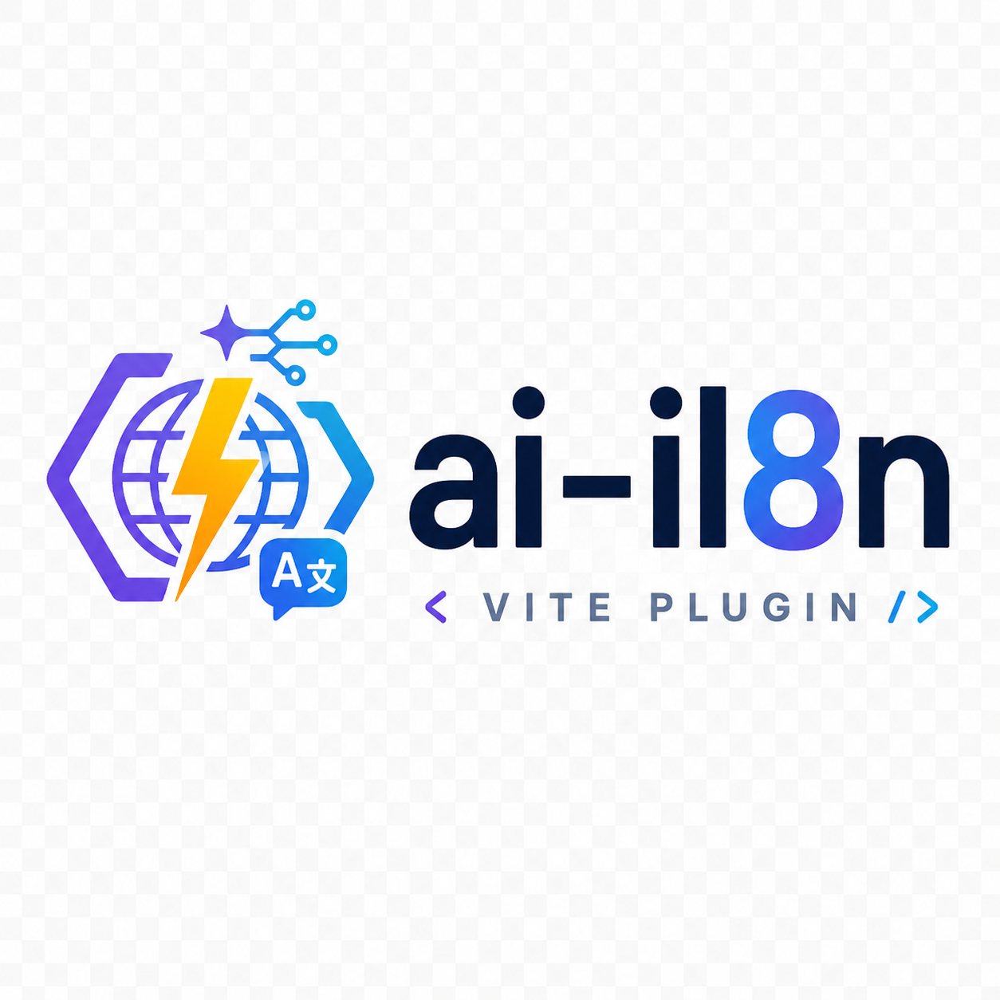

<p align="center">
  
</p>

<h1 align="center">ai-i18n</h1>

<p align="center">
  <b>面向 Vite 8 的自动化 AI 国际化插件</b>
</p>

<p align="center">
  <a href="https://bosens-china.github.io/ai-i18n/">📚 官方文档</a> •
  <a href="https://bosens-china.github.io/ai-i18n/demo/">🚀 在线演示</a> •
  <a href="https://github.com/bosens-China/ai-i18n">GitHub</a>
</p>

---

## ✨ 什么是 ai-i18n？

**ai-i18n** 是一款专为 Vite 8 打造的自动化 AI 国际化解决方案。它彻底摆脱了传统 i18n 繁琐的 Key 维护与手动 JSON 翻译流程——你只需在源码中直接书写 `t('简体中文')`，剩下的提取、维护与 AI 翻译全部由插件自动完成。

### 🌟 核心特性

- ⚡️ **源码即文案**：无需预先定义字典 Key，源码中直接写 `t()`，编译期由 Vite 插件自动提取。
- 🤖 **AI 自动翻译**：可选接入 LLM Provider（如 OpenAI），自动补全缺失多语言翻译。
- 💾 **Git 友好**：自动生成格式清晰、方便版本管理的 Translation Memory 翻译记忆库。
- 🧹 **有界缓存**：可按消息数或 UTF-8 字节限制 Translation Memory，只淘汰非活跃历史。
- 🔁 **增量 Build Watch**：`vite build --watch` 跨轮复用分析状态，只刷新变化依赖闭包。
- 🌍 **按语言加载**：目标语言可拆成独立 Vite chunk，并支持 preload、prefetch 和完全按需加载。
- 📦 **多框架支持**：开箱即用支持 Vanilla JS、Vue 3 以及 React 18/19。
- 🤖 **MCP 协议支持**：内置 MCP 工具服务，可直接与 AI Coding Agent（Cursor、Claude、Antigravity）协同巡检与补全翻译。

---

## ⚡️ 快速上手

### 1. 安装插件

```bash
pnpm add @ai-i18n/vite
```

### 2. 配置 `vite.config.ts`

```ts
import { defineConfig } from 'vite';
import { aiI18n } from '@ai-i18n/vite';

export default defineConfig({
  plugins: [
    aiI18n({
      sourceLang: 'zh-CN',
      locales: [
        { value: 'zh-CN', label: '中文' },
        { value: 'en-US', label: 'English' },
      ],
      framework: 'vue', // 或 'react' | 'vanilla'
    }),
  ],
});
```

### 3. 在代码中使用

```ts
import { t } from 'virtual:ai-i18n';

console.log(t('快速上手 AI 国际化'));
```

### 可选：按语言加载

```ts
aiI18n({
  sourceLang: 'zh-CN',
  locales: [
    { value: 'zh-CN', label: '中文' },
    { value: 'en-US', label: 'English' },
    { value: 'ja-JP', label: '日本語' },
  ],
  loading: {
    strategy: 'locale',
    preload: ['en-US'],
    prefetch: ['ja-JP'],
  },
});
```

开启后，source 文案保持同步可用，每个目标语言生成独立 chunk。未列入资源提示的语言在首次
`setLang()` 时加载。省略 `loading` 会保持原有的全语言注册模式。

### 可选：限制 Translation Memory

```ts
aiI18n({
  sourceLang: 'zh-CN',
  locales: [
    { value: 'zh-CN', label: '中文' },
    { value: 'en-US', label: 'English' },
  ],
  cache: {
    maxMessages: 20_000,
    maxBytes: 10 * 1024 * 1024,
  },
});
```

省略 `cache` 时仍永久保留历史 Translation Memory。启用后只按稳定 message ID 淘汰当前
源码不再引用的历史；活动翻译即使使 cache 超限也会保留，并输出 warning。

---

## 🔗 相关资源

- **[📖 完整用户文档](https://bosens-china.github.io/ai-i18n/)**：深入了解 API 配置、自定义 Provider 与 MCP 接入。
- **[🎮 在线 Demo](https://bosens-china.github.io/ai-i18n/demo/)**：体验 Vue 3、React 与 Vanilla 的即时切换效果。
