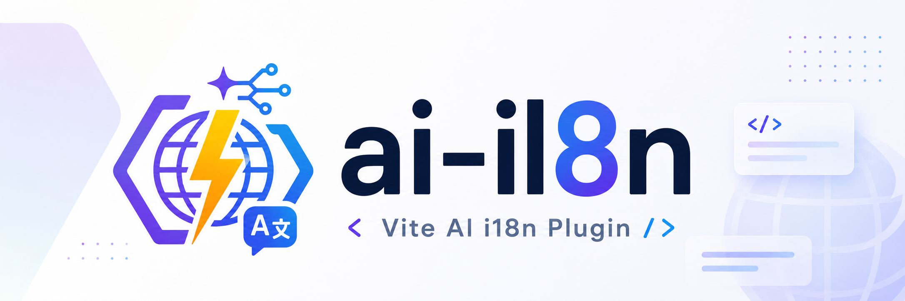

<p align="center">
  
</p>

<h1 align="center">ai-i18n</h1>

<p align="center">
  <b>面向 Vite 的自动化 AI 国际化插件</b><br>
  源码即文案 · 告别 Key 维护 · 全自动 AI 翻译 · 智能按需拆包 · 内置 MCP 协同
</p>

<p align="center">
  <a href="https://bosens-china.github.io/ai-i18n/">📚 官方文档</a> •
  <a href="https://bosens-china.github.io/ai-i18n/demo/">🚀 在线演示</a>
</p>

---

## ⚡️ 快速上手

### 1. 安装依赖

```bash
pnpm add @ai-i18n/vite
```

### 2. 配置 Vite

```ts
// vite.config.ts
import { defineConfig } from 'vite';
import { aiI18n } from '@ai-i18n/vite';

export default defineConfig({
  plugins: [
    aiI18n({
      sourceLang: 'zh-CN',
      locales: [
        { value: 'zh-CN', label: '简体中文' },
        { value: 'en-US', label: 'English' },
      ],
      framework: 'vue', // 支持 'vue' | 'react' | 'vanilla'
    }),
  ],
});
```

### 3. 直接在代码中使用

```ts
import { t } from 'virtual:ai-i18n';

// 无需预先定义 Key，直接书写源码文案
console.log(t('你好，世界！'));
```

## 📄 License

[MIT](./LICENSE) License © 2026-PRESENT
